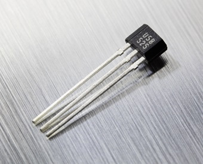

# Overview

Implementation of an [ESP32](https://en.wikipedia.org/wiki/ESP32) based sensor for detecting open/close condition of a Hall-effect sensor 
and communicating telemetry via Wifi to Google Cloud IoT Core and events to Pushover.

This is very much a "scratch your own itch" type project and is not intended for wide use. YMMV.

# Sensor Mk 1 

First version deployed. Major features:

* Hall-effect sensor to detect gate open/close
* The [Ultra-Low Power](https://docs.espressif.com/projects/esp-idf/en/latest/esp32/api-guides/ulp.html) 
  coprocessor [polls the Hall sensor](src/ulp_prog.h) while the main CPU remains in 
  deep sleep (main CPU is active for only ~3-5 seconds per hour)
* Open/Close event notifications via [Pushover](https://pushover.net/)
* Telemetry sent to [GCP IoT Core](https://cloud.google.com/iot-core) every 15 minutes

## Bill of Materials 

| Picture | Part | Description | 
| ------- | ---- | ----------- |
|  | [EzSBC ESP32-01](https://www.ezsbc.com/index.php/products/wifi01-33.html) | Power optimized ESP32 dev board |
|  | [Melexis US5881](https://www.melexis.com/en/product/US5881/Unipolar-Hall-Effect-Switch-Low-Sensitivity) | Sensor to detect when gate is open/closed via magnetic field |
|  | [Protected LG MJ1 18650](https://liionwholesale.com/collections/batteries/products/protected-lg-mj1-18650-battery-genuine-tested-10a-3500mah-button-top-wholesale-discount?variant=12530399684) | Battery to power ESP32 and Hall sensor |
|  | [Keystone 1042P](https://www.keyelco.com/product.cfm/product_id/918) | Battery holder |
|  | [Polycase SK-12](https://www.polycase.com/sk-12) | Water-resistant (IP66) enclosure w/ knock-outs |
|  | [Polycase CG-3 cable gland](https://www.polycase.com/cg3) | Water-resistant (IP68) ratcheting seal for Hall sensor cable |
|  | [KJ Magnetics DX04B-N52](https://www.kjmagnetics.com/proddetail.asp?prod=DX04B-N52) | 1" dia x 0.25" thick N52 neodymium disc magnet |
|  | [10k ohm resistor](https://www.adafruit.com/product/2784) | Pull-up for Hall sensor open-drain output pin |

## The Mk1 in the field

As installed on the gate 

Closeup of the _tiny_ gap between magnet and hall sensor

Everything stuffed into the enclosure

Enclosure contents unpacked (yes, I used pin jumper/hookup wires. Not exactly corrosion 
resistant I know).

Closeup of the US5881 Hall sensor installed into three female pin jumper sockets. Pins are
in order 1, 2, 3 from top to bottom. The resistor is applied across pins 1 (Vdd) and 
3 (Output) to pull-up the sensor's output pin. Pin 2 is ground. 

# Waterproofing the sensor with a conformal coating 

Why the slick and shiny appearance of the pin sockets and sensor? Thanks to the super-
sophisticated _conformal coating_ ... aka clear gel nail polish! ;) 

## Power consumption

| Source | Current (milli-Amps) |
| ------ | --------- |
| ESP32 active, WiFi TX   | 260.0   |
| ESP32 deep sleep in ULP |   0.017 |
| US5881 (3.3V * 10kOhm)  |   0.330 |

# Shout-outs and resources

* Big thank you to [@TvE](https://github.com/tve) for the amazing 
[Running Wifi Microcontrollers on Battery](https://blog.voneicken.com/projects/low-power-wifi-intro/)
blog series. 

# Tested ESP32 boards

Selection criteria

* Low deep-sleep power consumption on battery - needs to run for 45+ days on a 3,000 mAh 18650 battery.
* Development convenience - easy to use, integrated battery connector, no bugs/annoyances. 

## [Adafruit Feather HUZZAH32](https://www.adafruit.com/product/3405)

WROOM-32 based development board. Very high-quality Adafruit part with superb 
[documentation](https://learn.adafruit.com/adafruit-huzzah32-esp32-feather).

Unfortunately has high quiescent power consumption (see https://blog.voneicken.com/2018/lp-wifi-esp32-boards/) 
making it a poor choice for powering via a battery. So Sad.

## [EzSBC ESP32-01](https://www.ezsbc.com/index.php/products/wifi01-33.html)

Out of the box 17uA quiescent power consumption. WROOM-32 based board just like the Feather. Great price.

Board pinout: 

# Battery 

The EzSBC lacks a battery controller so battery [protection](https://learn.adafruit.com/li-ion-and-lipoly-batteries/protection-circuitry) 
must be provided elsewhere. The sensor uses a 3,500 mAh [LG MJ1 18650](https://cdn.shopify.com/s/files/1/0697/3395/files/Specification_INR18650MJ1_22.08.2014.pdf) 
with integrated protection board from [LiIon Wholesale](https://liionwholesale.com/collections/batteries/products/protected-lg-mj1-18650-battery-genuine-tested-10a-3500mah-button-top-wholesale-discount?variant=12530399684). 

# Random notes

## Wifi AP tweaks for lower-power devices

* Ensure multicast/broadcast filtering is enabled to prevent ARP and other random packets from
  potentially waking device. 
* Increase DTIM period.
 
## On-board Hall effect sensor compared to external sensor (Melexis US5881)

ESP32's on-board Hall effect sensor calibration varies between chips, is not that sensitive, 
and is fairly noisy. The [Melexis US5881](https://www.melexis.com/en/product/US5881/Unipolar-Hall-Effect-Switch-Low-Sensitivity) 
is a great replacement. It reads as Vgnd/0 V when the south pole is present (0 from the ADC) and 
Vdd/3.3 V when "open" (4095 in the ADC). 

## Lower power consumption in ESP32

* Disable GPIO pins 12 and 15 to prevent drain from internal pull-ups.

# Copyright and license

Copyright (c) 2020 int08h LLC. All rights reserved.

Licensed under the Apache License, Version 2.0 (the "License");
you may not use this file except in compliance with the License.
You may obtain a copy of the License at

  http://www.apache.org/licenses/LICENSE-2.0

Unless required by applicable law or agreed to in writing, software
distributed under the License is distributed on an "AS IS" BASIS,
WITHOUT WARRANTIES OR CONDITIONS OF ANY KIND, either express or implied.
See the License for the specific language governing permissions and
limitations under the License.